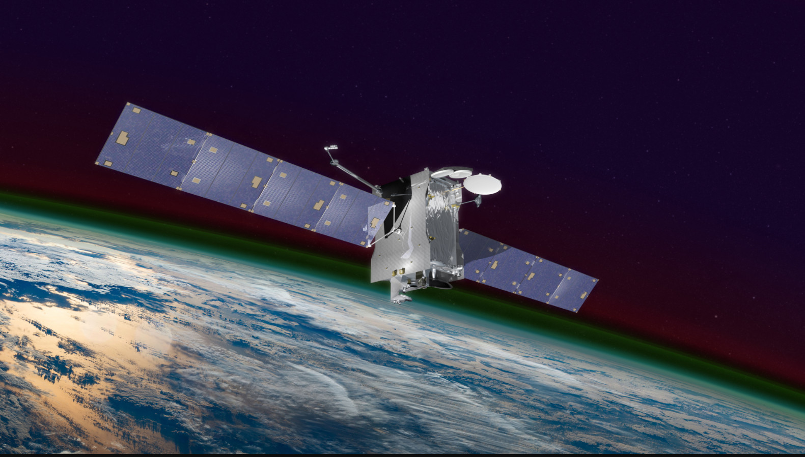

**Interplanetary Gatsby** is a blog about making **space-grade websites**.

"Static" and "offline-first" don't really do them justice.

**In space, there is no such thing as "online"**—this naïve illusion of
near-simultaneity bore by the small window of low-latency communications that
graced our species in the few decades that followed millennia of foot, horse,
and sea, and preceded our belated (re)launch into the deeper waters of the
cosmic ocean.

For light is slow, and so far as our minds have been able to see, there is no
short-term escape to its grasp on the reach of our interstellar voice.

Asynchrony is all that is or ever was or ever will be.

---

Mars is 3.2 light-minutes away at its closest and 22.2 light-minutes away at
its farthest.

Imagine clicking a link to a news article and sitting there for a _minimum_ of
**6 minutes** for it to load.

It doesn't matter how hand-optimized the page is or how high your bandwidth.
That's the fixed cost that the very first bit will have to crawl through before
it gets to you.

How do you design around this constraint?

You cache the hell out of everything. You prefetch. You reach out to people on
your own planet before capitulating to the space link. You change the user
experience to decouple fetching from reading, you queue and notify instead of
blocking and spinning.

These are the things I want to explore with [Gatsby](https://gatsbyjs.org) and
[IPFS](https://ipfs.io 'InterPlanetary File System')—the InterPlanetary File
System.

They are the perfect tools for this job, and I invite you to join me on this
journey _into the vastness of the Merkleverse_.
